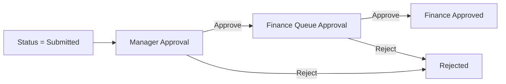

# Expense Reimbursement System — Code Bundle

This file contains:
- LWC Wizard code
- Apex controller used by the wizard
- Apex trigger/handler to auto-mark receipt attachment
- Apex test class
- Initial flow diagram (receipt enforcement on submit)

---

## 1) LWC — `expenseClaimWizard`

### `expenseClaimWizard.html`
```html
<template>
    <lightning-card title="Expense Claim Wizard">
        <div class="slds-p-around_medium">

            <lightning-progress-indicator current-step={currentStep} type="base">
                <lightning-progress-step label="Claim" value="1"></lightning-progress-step>
                <lightning-progress-step label="Line Items" value="2"></lightning-progress-step>
                <lightning-progress-step label="Receipts" value="3"></lightning-progress-step>
                <lightning-progress-step label="Review & Submit" value="4"></lightning-progress-step>
            </lightning-progress-indicator>

            <template if:true={isStep1}>
                <div class="slds-m-top_medium">
                    <lightning-input label="Cost Center" value={costCenter} onchange={onCostCenter}></lightning-input>
                    <lightning-textarea label="Business Justification" value={justification} onchange={onJustification}></lightning-textarea>
                </div>
            </template>

            <template if:true={isStep2}>
                <div class="slds-m-top_medium slds-grid slds-gutters">
                    <div class="slds-col">
                        <lightning-combobox label="Expense Type" value={liType} options={expenseTypeOptions} onchange={onLiType}></lightning-combobox>
                    </div>
                    <div class="slds-col">
                        <lightning-input type="date" label="Expense Date" value={liDate} onchange={onLiDate}></lightning-input>
                    </div>
                    <div class="slds-col">
                        <lightning-input type="number" label="Amount" value={liAmount} onchange={onLiAmount}></lightning-input>
                    </div>
                </div>

                <div class="slds-m-top_small slds-grid slds-gutters">
                    <div class="slds-col">
                        <lightning-input label="Merchant" value={liMerchant} onchange={onLiMerchant}></lightning-input>
                    </div>
                    <div class="slds-col">
                        <lightning-input label="Description" value={liDesc} onchange={onLiDesc}></lightning-input>
                    </div>
                </div>

                <div class="slds-m-top_small">
                    <lightning-button label="Add Line Item" variant="brand" onclick={addLineItem}></lightning-button>
                </div>

                <div class="slds-m-top_medium">
                    <lightning-datatable
                        key-field="Id"
                        data={lineItems}
                        columns={columns}
                        hide-checkbox-column
                        onrowaction={handleRowAction}>
                    </lightning-datatable>
                </div>
            </template>

            <template if:true={isStep3}>
                <div class="slds-m-top_medium">
                    <p class="slds-text-body_regular slds-m-bottom_small">
                        Upload receipts (PDF/JPG/PNG). Upload to the claim record.
                    </p>
                    <lightning-file-upload
                        label="Upload Receipts"
                        record-id={claimId}
                        multiple
                        onuploadfinished={handleUploadFinished}>
                    </lightning-file-upload>
                </div>
            </template>

            <template if:true={isStep4}>
                <div class="slds-m-top_medium">
                    <p><b>Claim:</b> {claimName}</p>
                    <p><b>Status:</b> {claimStatus}</p>
                    <p><b>Total Expense Amount:</b> {totalAmount}</p>
                    <p class="slds-m-top_small"><b>Line Items:</b> {lineItemCount}</p>
                    <p class="slds-text-color_weak slds-m-top_small">
                        Submit will run receipt checks and then route to Manager → Finance approvals.
                    </p>
                </div>
            </template>

            <div class="slds-m-top_large slds-grid slds-grid_align-spread">
                <lightning-button label="Back" onclick={back} disabled={isFirst}></lightning-button>
                <div>
                    <template if:false={isStep4}>
                        <lightning-button label="Next" variant="brand" onclick={next} disabled={nextDisabled}></lightning-button>
                    </template>
                    <template if:true={isStep4}>
                        <lightning-button
                            label="Submit for Approval"
                            variant="brand"
                            onclick={submit}
                            disabled={submitted}>
                        </lightning-button>
                    </template>
                </div>
            </div>

        </div>
    </lightning-card>
</template>
```

### `expenseClaimWizard.js`
```js
import { LightningElement, track } from 'lwc';
import { ShowToastEvent } from 'lightning/platformShowToastEvent';

import createDraftClaim from '@salesforce/apex/ExpenseClaimWizardController.createDraftClaim';
import getClaim from '@salesforce/apex/ExpenseClaimWizardController.getClaim';
import getLineItems from '@salesforce/apex/ExpenseClaimWizardController.getLineItems';
import addLineItemApex from '@salesforce/apex/ExpenseClaimWizardController.addLineItem';
import deleteLineItem from '@salesforce/apex/ExpenseClaimWizardController.deleteLineItem';
import submitClaimForApproval from '@salesforce/apex/ExpenseClaimWizardController.submitClaimForApproval';

export default class ExpenseClaimWizard extends LightningElement {
    @track currentStep = '1';

    costCenter = '';
    justification = '';

    claimId;
    claimName = '';
    claimStatus = '';
    totalAmount;
    @track lineItems = [];

    liType = '';
    liDate = '';
    liAmount = '';
    liMerchant = '';
    liDesc = '';

    submitted = false;

    columns = [
        { label: 'Type', fieldName: 'Expense_Type__c' },
        { label: 'Date', fieldName: 'Expense_Date__c', type: 'date' },
        { label: 'Amount', fieldName: 'Amount__c', type: 'currency' },
        { label: 'Merchant', fieldName: 'Merchant__c' },
        { label: 'Receipt Required', fieldName: 'Receipt_Required__c', type: 'boolean' },
        { label: 'Receipt Attached', fieldName: 'Receipt_Attached__c', type: 'boolean' },
        {
            type: 'button',
            fixedWidth: 120,
            typeAttributes: { label: 'Delete', name: 'delete', variant: 'destructive' }
        }
    ];

    get expenseTypeOptions() {
        return [
            { label: 'Meals', value: 'Meals' },
            { label: 'Travel', value: 'Travel' },
            { label: 'Hotel', value: 'Hotel' },
            { label: 'Supplies', value: 'Supplies' },
            { label: 'Other', value: 'Other' }
        ];
    }

    get isStep1() { return this.currentStep === '1'; }
    get isStep2() { return this.currentStep === '2'; }
    get isStep3() { return this.currentStep === '3'; }
    get isStep4() { return this.currentStep === '4'; }
    get isFirst() { return this.currentStep === '1'; }
    get lineItemCount() { return (this.lineItems || []).length; }

    get nextDisabled() {
        if (this.isStep1) return !(this.costCenter && this.justification);
        if (this.isStep2) return !(this.claimId && this.lineItemCount > 0);
        if (this.isStep3) return !this.claimId;
        return false;
    }

    onCostCenter = (e) => { this.costCenter = e.target.value; };
    onJustification = (e) => { this.justification = e.target.value; };

    onLiType = (e) => { this.liType = e.detail.value; };
    onLiDate = (e) => { this.liDate = e.target.value; };
    onLiAmount = (e) => { this.liAmount = e.target.value; };
    onLiMerchant = (e) => { this.liMerchant = e.target.value; };
    onLiDesc = (e) => { this.liDesc = e.target.value; };

    async next() {
        try {
            if (this.isStep1) {
                const id = await createDraftClaim({ costCenter: this.costCenter, justification: this.justification });
                this.claimId = id;
                await this.refreshClaimAndItems();
                this.currentStep = '2';
                return;
            }
            if (this.isStep2) {
                await this.refreshClaimAndItems();
                this.currentStep = '3';
                return;
            }
            if (this.isStep3) {
                await this.refreshClaimAndItems();
                this.currentStep = '4';
                return;
            }
        } catch (err) {
            this.toastError(err);
        }
    }

    back() {
        if (this.isStep2) this.currentStep = '1';
        else if (this.isStep3) this.currentStep = '2';
        else if (this.isStep4) this.currentStep = '3';
    }

    async addLineItem() {
        try {
            if (!this.claimId) {
                this.toast('Create claim first', 'Please complete Step 1 first.', 'warning');
                return;
            }
            if (!(this.liType && this.liDate && this.liAmount)) {
                this.toast('Missing fields', 'Expense Type, Date, and Amount are required.', 'warning');
                return;
            }

            await addLineItemApex({
                claimId: this.claimId,
                expenseType: this.liType,
                expenseDate: this.liDate,
                amount: this.liAmount,
                merchant: this.liMerchant,
                description: this.liDesc
            });

            this.liType = '';
            this.liDate = '';
            this.liAmount = '';
            this.liMerchant = '';
            this.liDesc = '';

            await this.refreshClaimAndItems();
            this.toast('Added', 'Line item added.', 'success');
        } catch (err) {
            this.toastError(err);
        }
    }

    async handleRowAction(event) {
        const action = event.detail.action.name;
        const row = event.detail.row;
        if (action === 'delete') {
            try {
                await deleteLineItem({ lineItemId: row.Id });
                await this.refreshClaimAndItems();
                this.toast('Deleted', 'Line item deleted.', 'success');
            } catch (err) {
                this.toastError(err);
            }
        }
    }

    handleUploadFinished() {
        this.toast('Uploaded', 'Receipt(s) uploaded.', 'success');
        this.refreshClaimAndItems();
    }

    async submit() {
        try {
            await submitClaimForApproval({ claimId: this.claimId });

            this.submitted = true;

            this.dispatchEvent(
                new ShowToastEvent({
                    title: 'Submitted',
                    message: 'Claim submitted for approval',
                    variant: 'success'
                })
            );

            window.location.href = '/lightning/n/Expense_Claim_Wizard';

        } catch (err) {
            this.toastError(err);
        }
    }

    async refreshClaimAndItems() {
        if (!this.claimId) return;
        const c = await getClaim({ claimId: this.claimId });
        this.claimName = c.Name;
        this.claimStatus = c.Status__c;
        this.totalAmount = c.Total_Expense_Amount__c;

        this.lineItems = await getLineItems({ claimId: this.claimId });
    }

    toast(title, message, variant) {
        this.dispatchEvent(new ShowToastEvent({ title, message, variant }));
    }

    toastError(err) {
        const msg = err?.body?.message || err?.message || 'Unknown error';
        this.toast('Error', msg, 'error');
    }
}
```

### `expenseClaimWizard.js-meta.xml`
```xml
<?xml version="1.0" encoding="UTF-8"?>
<LightningComponentBundle xmlns="http://soap.sforce.com/2006/04/metadata">
    <apiVersion>65.0</apiVersion>
    <isExposed>true</isExposed>
    <targets>
        <target>lightning__RecordPage</target>
        <target>lightning__AppPage</target>
        <target>lightning__HomePage</target>
    </targets>
</LightningComponentBundle>
```

---

## 2) Apex — Wizard Controller

### `ExpenseClaimWizardController.cls`
```apex
public with sharing class ExpenseClaimWizardController {

    @AuraEnabled
    public static Id createDraftClaim(String costCenter, String justification) {
        Expense_Claim__c c = new Expense_Claim__c();
        c.Status__c = 'Draft';
        c.Cost_Center__c = costCenter;
        c.Business_Justification__c = justification;
        c.Employee__c = UserInfo.getUserId();
        insert c;
        return c.Id;
    }

    @AuraEnabled
    public static Expense_Claim__c getClaim(Id claimId) {
        return [
            SELECT Id, Name, Status__c, Cost_Center__c, Business_Justification__c, Total_Expense_Amount__c
            FROM Expense_Claim__c
            WHERE Id = :claimId
            LIMIT 1
        ];
    }

    @AuraEnabled
    public static List<Expense_Line_Item__c> getLineItems(Id claimId) {
        return [
            SELECT Id, Name, Expense_Type__c, Expense_Date__c, Amount__c, Merchant__c, Description__c,
                   Receipt_Required__c, Receipt_Attached__c
            FROM Expense_Line_Item__c
            WHERE Expense_Claim__c = :claimId
            ORDER BY CreatedDate DESC
        ];
    }

    @AuraEnabled
    public static Id addLineItem(
        Id claimId,
        String expenseType,
        Date expenseDate,
        Decimal amount,
        String merchant,
        String description
    ) {
        Expense_Line_Item__c li = new Expense_Line_Item__c();
        li.Expense_Claim__c = claimId;
        li.Expense_Type__c = expenseType;
        li.Expense_Date__c = expenseDate;
        li.Amount__c = amount;
        li.Merchant__c = merchant;
        li.Description__c = description;
        insert li;
        return li.Id;
    }

    @AuraEnabled
    public static void deleteLineItem(Id lineItemId) {
        delete [SELECT Id FROM Expense_Line_Item__c WHERE Id = :lineItemId LIMIT 1];
    }

    @AuraEnabled
    public static void submitClaimForApproval(Id claimId) {
        Expense_Claim__c c = [SELECT Id, Status__c FROM Expense_Claim__c WHERE Id = :claimId LIMIT 1];
        c.Status__c = 'Submitted';
        update c;

        Approval.ProcessSubmitRequest req = new Approval.ProcessSubmitRequest();
        req.setObjectId(claimId);
        Approval.ProcessResult res = Approval.process(req);

        if (!res.isSuccess()) {
            throw new AuraHandledException('Approval submission failed.');
        }
    }
}
```

---

## 3) Apex — Auto-mark receipt attached

### `ContentDocumentLinkTrigger.trigger`
```apex
trigger ContentDocumentLinkTrigger on ContentDocumentLink (after insert) {
    ContentDocumentLinkHandler.handleAfterInsert(Trigger.new);
}
```

### `ContentDocumentLinkHandler.cls`
```apex
public with sharing class ContentDocumentLinkHandler {

    public static void handleAfterInsert(List<ContentDocumentLink> newLinks) {
        if (newLinks == null || newLinks.isEmpty()) return;

        Set<Id> claimIds = new Set<Id>();

        for (ContentDocumentLink cdl : newLinks) {
            if (cdl.LinkedEntityId != null && String.valueOf(cdl.LinkedEntityId).startsWith('a')) {
                claimIds.add(cdl.LinkedEntityId);
            }
        }
        if (claimIds.isEmpty()) return;

        Map<Id, Expense_Claim__c> claims = new Map<Id, Expense_Claim__c>(
            [SELECT Id FROM Expense_Claim__c WHERE Id IN :claimIds]
        );
        if (claims.isEmpty()) return;

        List<Expense_Line_Item__c> toUpdate = [
            SELECT Id, Receipt_Attached__c
            FROM Expense_Line_Item__c
            WHERE Expense_Claim__c IN :claims.keySet()
            AND Receipt_Required__c = TRUE
            AND Receipt_Attached__c = FALSE
        ];

        if (!toUpdate.isEmpty()) {
            for (Expense_Line_Item__c li : toUpdate) {
                li.Receipt_Attached__c = true;
            }
            update toUpdate;
        }
    }
}
```

### `ContentDocumentLinkHandlerTest.cls`
```apex
@IsTest
public class ContentDocumentLinkHandlerTest {

    @IsTest
    static void marksReceiptAttachedWhenFileLinkedToClaim() {
        Expense_Claim__c claim = new Expense_Claim__c(
            Status__c = 'Draft',
            Cost_Center__c = 'IT',
            Business_Justification__c = 'Test',
            Employee__c = UserInfo.getUserId()
        );
        insert claim;

        Expense_Line_Item__c li = new Expense_Line_Item__c(
            Expense_Claim__c = claim.Id,
            Expense_Type__c = 'Meals',
            Expense_Date__c = Date.today().addDays(-1),
            Amount__c = 60,
            Merchant__c = 'Test',
            Description__c = 'Test',
            Receipt_Attached__c = false
        );
        insert li;

        ContentVersion cv = new ContentVersion(
            Title = 'Receipt',
            PathOnClient = 'Receipt.pdf',
            VersionData = Blob.valueOf('dummy')
        );
        insert cv;

        Id docId = [SELECT ContentDocumentId FROM ContentVersion WHERE Id = :cv.Id].ContentDocumentId;

        Test.startTest();
        insert new ContentDocumentLink(
            LinkedEntityId = claim.Id,
            ContentDocumentId = docId,
            ShareType = 'V'
        );
        Test.stopTest();

        li = [SELECT Receipt_Attached__c FROM Expense_Line_Item__c WHERE Id = :li.Id];
        System.assertEquals(true, li.Receipt_Attached__c);
    }
}
```

---

## 4) Initial Flow Diagram (Receipt enforcement on Submit)

```mermaid
flowchart TD
    A[User changes Claim Status -> Submitted] --> B[Flow Start (Before Save)]
    B --> C[Get Line Items for Claim]
    C --> D{Loop each Line Item}
    D --> E{Receipt Required = TRUE AND Receipt Attached = FALSE?}
    E -- Yes --> F[Custom Error on Claim.Status: "Receipts required before submission"]
    E -- No --> D
    F --> G[Block save/update (Status stays Draft)]
    D --> H[End (Allowed)]
```

---

## 5) Approvals (high-level)


