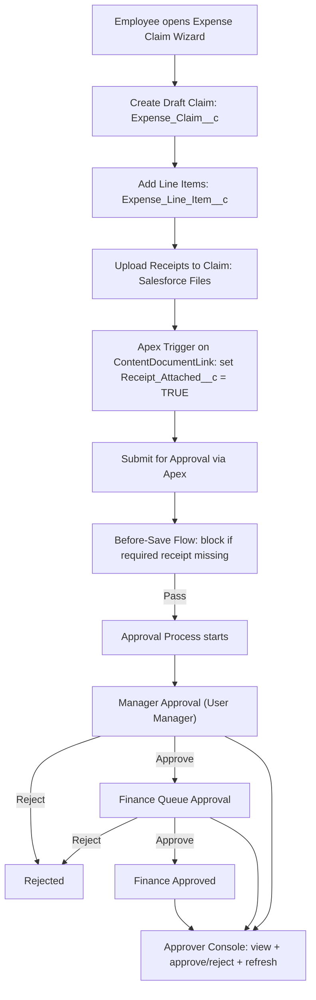

# Expense Reimbursement System – Salesforce (LWC + Apex)

## What Problem This Solves
Many organizations manage expense reimbursements using emails, spreadsheets, or loosely controlled forms, which leads to:
- Missing or incomplete receipts
- Policy violations due to missing documentation
- Slow, fragmented approval processes
- Poor visibility for Finance teams
- Manual follow-ups and audit risk

This system solves these issues by providing:
- A guided, step-by-step submission experience for employees
- Automatic enforcement of receipt and policy rules
- A structured approval workflow for Managers and Finance
- A centralized approval console with full visibility into claims, line items, and receipts
- An auditable, scalable process built directly on Salesforce

---

## Overview
A production-style Expense Reimbursement System built on Salesforce that enables employees to submit expense claims through a guided wizard, enforces receipt policies, and routes approvals through Manager and Finance — all with a dedicated Approver Console for fast decision-making.

This project demonstrates real-world Salesforce engineering using LWC, Apex, Flows, Approvals, and Files, focusing on usability, automation, and data integrity.

---

## System Flow Diagram

---

## Key Features

### Employee Experience (Wizard – LWC)
- Multi-step Expense Claim Wizard:
  1. Select Cost Center (dynamic picklist)
  2. Add Expense Line Items
  3. Upload Receipts
  4. Review & Submit for Approval
- Automatic total calculation via roll-up summary
- Prevents double submission
- Redirects user after successful submission

### Policy Enforcement & Automation
- Receipt Required logic implemented using a formula field
- Before-save Flow blocks submission if required receipts are missing
- Apex trigger on file upload automatically marks receipts as attached

### Approval Process
- Multi-level approval workflow:
  - Manager Approval
  - Finance Queue Approval
- Status updates at each stage
- Rejection requires comments

### Approver Console (LWC)
- Single-screen console for Managers and Finance users
- Displays pending approvals (user + queue-based)
- Shows claim details, line items, and uploaded receipts
- Approve / Reject directly from the console
- Live refresh without page reload

---

## Architecture Overview
LWC (Wizard & Console)
→ Apex Controllers
→ Flows & Approval Process
→ Salesforce Files + Triggers

---

## Technical Stack
- Frontend: Lightning Web Components (LWC)
- Backend: Apex (Controllers, Triggers)
- Automation: Record-Triggered Flows
- Approvals: Salesforce Approval Process
- Data Model: Custom Objects, Master-Detail, Roll-up Summaries
- Files: Salesforce Files (ContentDocumentLink)

---

## Objects Used
- Expense_Claim__c
- Expense_Line_Item__c
- Salesforce Files (Receipts)

---

## Notable Design Decisions
- Wizard over Screen Flow for better UX and control
- Apex for receipt detection due to system object limitations in Flow
- Queue-aware approval console to support Finance approvals
- Defensive UI rendering to prevent runtime errors

---

## How to Demo
1. Launch Expense Claim Wizard
2. Create a claim and add line items
3. Upload receipt(s)
4. Submit for approval
5. Approve as Manager
6. Approve or reject as Finance from the Approver Console

---

## What This Project Demonstrates
- End-to-end Salesforce application design
- LWC and Apex integration
- Real-world approval workflows
- Automation and validation best practices
- User-centric UI/UX decisions

---

